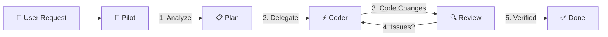

# 🤖 AI Pilot

[](LICENSE)
[](https://github.com/manhpd98/ai-pilot)

> **Multi-Agent Coding Workflow** — Use one AI to plan, review, and verify while another writes the code. Like pairing a Tech Lead with a Senior Developer.

## The Problem

Using a single AI for everything creates a bottleneck. It plans, writes, reviews, and tests — all in one context. The result? Unfocused output and missed bugs.

## The Solution

**Split the roles.** One AI thinks. Another acts.



| Role | Tool | Responsibility |
|------|------|----------------|
| 🧠 **Pilot** | Antigravity | Analyze → Plan → Review → Test → Report |
| ⚡ **Coder** | Claude Code / OpenCode | Write → Edit → Refactor |

## Quick Start

### 1. Add to your project

```bash
git clone https://github.com/manhpd98/ai-pilot.git
cp -r ai-pilot/.agent /path/to/your/project/
```

### 2. Install an AI Worker

```bash
# Claude Code — requires Claude Pro/Max subscription
npm install -g @anthropic-ai/claude-code

# OpenCode — free, supports 75+ AI models
curl -fsSL https://opencode.ai/install | bash
```

### 3. Start using it

Tell Antigravity what you need:

> _"Fix the login crash — delegate coding to Claude Code"_

AI Pilot automatically:

1. 📋 Analyzes your codebase
2. 🗺️ Creates an implementation plan
3. ⚡ Delegates coding to Claude Code
4. 🔍 Reviews all changes
5. ✅ Runs tests & verifies
6. 📊 Reports results

## What's Inside

```
.agent/
├── skills/
│   └── ai-delegation/
│       └── SKILL.md                  # Core delegation logic & prompt templates
└── workflows/
    ├── delegate-claude.md            # Claude Code workflow
    ├── delegate-opencode.md          # OpenCode workflow
    ├── code-review.md                # AI code review pipeline
    └── debug.md                      # Structured debugging flow
```

**Bonus Resources:**

```
templates/
├── prompt-templates.md               # Ready-to-use prompts for any task
└── project-configs/                  # Platform-specific configs
    ├── ios.md                        #   iOS / Swift / Xcode
    ├── android.md                    #   Android / Kotlin / Gradle
    ├── web.md                        #   Web / React / Next.js
    ├── flutter.md                    #   Flutter / Dart
    └── python.md                     #   Python / FastAPI / Django
examples/
├── fix-bug.md                        # Real example: bugfix workflow
├── add-feature.md                    # Real example: feature workflow
└── refactor.md                       # Real example: refactor workflow
docs/
├── getting-started.md                # Detailed setup guide
├── best-practices.md                 # Tips & anti-patterns
└── supported-workers.md              # All supported AI tools
```

## Why Multi-Agent?

| | Single AI | AI Pilot (Multi-Agent) |
|---|---|---|
| **Planning** | Same context as coding | Dedicated analysis & planning |
| **Code Quality** | Self-reviews own work | Independent review by different AI |
| **Verification** | Often skipped | Systematic testing after every change |
| **Complex Tasks** | Context gets muddled | Clear task delegation & tracking |
| **Error Recovery** | Keeps going | Catches issues & sends corrections |

## Supported AI Workers

| Worker | Command | Auth | Best For |
|--------|---------|------|----------|
| [Claude Code](https://www.anthropic.com/claude-code) | `claude` | Claude Pro/Max | Complex refactoring, multi-file edits |
| [OpenCode](https://opencode.ai) | `opencode` | Free / BYO API key | Quick tasks, 75+ AI providers |

## Documentation

- 📖 [Getting Started](docs/getting-started.md) — Full setup guide
- 💡 [Best Practices](docs/best-practices.md) — Tips & anti-patterns
- 📝 [Prompt Templates](templates/prompt-templates.md) — Ready-to-use prompts
- 🔧 [Supported Workers](docs/supported-workers.md) — All compatible AI tools
- 📂 [Examples](examples/) — Real-world workflow walkthroughs
- 🇻🇳 [Hướng Dẫn Tiếng Việt](docs/huong-dan-su-dung.md) — Vietnamese guide with diagrams

## Contributing

PRs welcome! Areas we'd love help with:

- New AI worker integrations (Aider, Cursor, Cline, etc.)
- Platform-specific configs for more frameworks
- More real-world examples
- Translations

## License

[MIT](LICENSE) — Use freely in any project.

