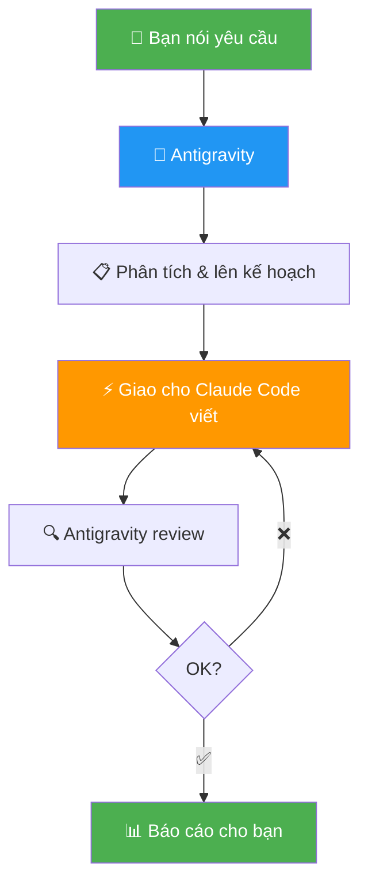

# 🇻🇳 Hướng Dẫn Sử Dụng Multi-Agent Coding

> **Antigravity** quản lý, lên kế hoạch, kiểm tra — **Claude Code** viết code.

## Sơ Đồ



## Cách Dùng

**Bước 1:** Mở project trong VS Code (đã có Antigravity)

**Bước 2:** Nói với Antigravity:
> _"Sửa lỗi crash ở màn login, dùng Claude Code viết code"_

**Bước 3:** Antigravity tự động:
1. Đọc code, phân tích vấn đề
2. Lên kế hoạch sửa
3. Mở Claude Code → giao task cụ thể
4. Review code Claude viết
5. Chạy build + test
6. Báo cáo kết quả cho bạn

## Ví Dụ

```
Bạn: "Fix crash onboarding" 

Antigravity:
├── Phân tích → lỗi IndexOutOfBounds
├── Giao Claude Code: "Sửa getItemCount() trong OnboardingAdapter.kt"
├── Review → OK
├── Build → Pass ✅
└── Báo cáo: "Đã fix, do hardcode số item"
```

```
Bạn: "Thêm dark mode"

Antigravity:
├── Lên plan → 3 tasks
├── Task 1 → Claude Code: tạo ThemeProvider
├── Task 2 → Claude Code: thêm nút toggle
├── Task 3 → Claude Code: thêm CSS dark
├── Build → OK ✅
└── Báo cáo: "Dark mode hoạt động"
```

## Yêu Cầu

| Tool | Cài đặt |
|------|---------|
| Antigravity | VS Code extension (đã có) |
| Claude Code | `npm install -g @anthropic-ai/claude-code` |

## Mẹo

- **Nói cụ thể** — Tên file, tên function, không mơ hồ
- **Một việc một lúc** — Chia nhỏ task lớn
- **Để Antigravity review** — Không bỏ qua bước kiểm tra

---